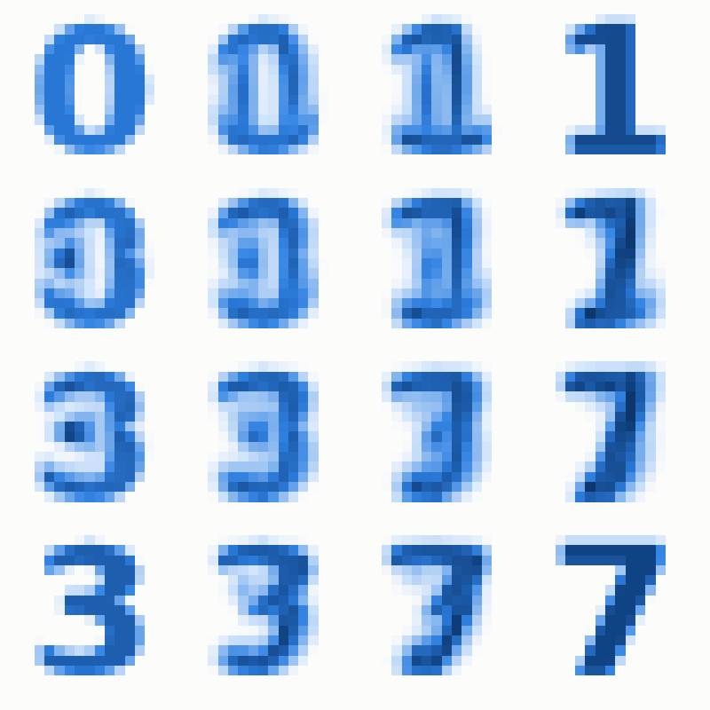
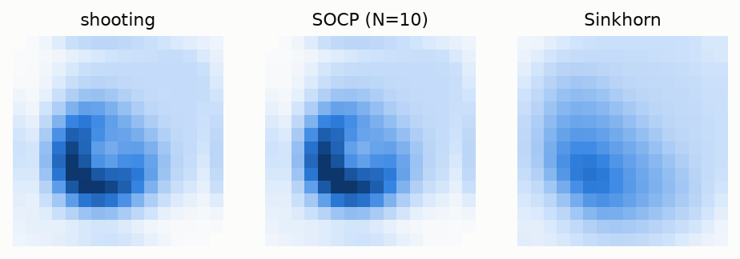

# graphtransport

[](https://github.com/dcgentile/graphtransport-py/actions/workflows/ci.yml)
[](https://dcgentile.github.io/graphtransport-py/)

**Optimal transport on graphs.** Geodesics, distances, barycenters and
barycentric coordinates for densities on the nodes of a graph, under the
discrete transport metric of Maas and of Chow, Huang, Li and Zhou.
Differentiable with PyTorch. It builds on
[Gentile & Murphy (2026)](https://arxiv.org/abs/2603.26940); see [Citing](#citing).

<p align="center">
  <picture>
    <source media="(prefers-color-scheme: dark)" srcset="docs/assets/hero-dark.gif">
    
  </picture>
  <br>
  <em>A geodesic from a blob to a ring on the 16×16 grid graph (display smoothed between nodes).</em>
</p>

**Documentation:** <https://dcgentile.github.io/graphtransport-py/>

## What it does

- **Geodesics and distances** between two densities: the whole transport path,
  its momenta and potentials, and the distance $W$.
- **Barycenters**: the density minimizing $\sum_i \lambda_i W^2(\rho_i, \nu)$ for
  reference densities $\rho_i$ and weights $\lambda_i$.
- **Barycentric analysis**: the weights that make a given density a barycenter
  of the references.
- **Three methods behind one API**: Newton shooting on the geodesic equations
  (fourth-order in time, with an adaptive multiple-shooting mode), a second-order cone
  program (handles densities that are zero on part of the graph), and entropic
  Sinkhorn.
- **Gradients**: `geodesic` and `transport_cost` take torch tensors, with exact
  gradients through the solver.
- **Any reversible Markov chain**: grids, hypercubes and other built-in graphs,
  or your own from an edge list, adjacency or weight matrix, with a choice of
  mean for the metric.

## Install

```
pip install torch --index-url https://download.pytorch.org/whl/cpu
pip install "graphtransport[socp] @ git+https://github.com/dcgentile/graphtransport-py"
```

PyTorch is required. A plain `pip install torch` on Linux fetches the CUDA
build, several GB, so install the CPU build first as above. The `[socp]` extra
adds cvxpy and Clarabel for the SOCP method; the default method doesn't need it.

## Quick start

```python
import numpy as np
import graphtransport as gt

G = gt.MarkovGraph(*gt.grid_markov_chain(5))       # a 5x5 grid and its random walk
rng = np.random.default_rng(0)
a, b = rng.uniform(0.5, 1.5, G.n), rng.uniform(0.5, 1.5, G.n)
a, b = a / (a @ G.pi), b / (b @ G.pi)                # densities with respect to G.pi

sol = gt.geodesic(G, a, b)                          # sol.W2, and sol.rho: the (n, 151) path
W = gt.transport_cost(G, a, b)                      # the distance itself
nu, J, info = gt.barycenter(G, [a, b], [0.3, 0.7])  # the weighted barycenter
lam = gt.analysis(G, nu, [a, b])                    # recovers [0.3, 0.7]
```

Densities are taken **with respect to `G.pi`**, the chain's stationary
distribution: `rho @ G.pi == 1`. The probability vector a density stands for is
`rho * G.pi`.

## Pictures

<p align="center">
  <picture>
    <source media="(prefers-color-scheme: dark)" srcset="docs/assets/digits-dark.png">
    
  </picture>
</p>

**Barycenters of digits.** The corners are four 16×16 digit images, each a
density on the pixel grid. Every other panel is their barycenter, for weights
that vary bilinearly across the square. The digits are centered on top of one
another, so mass only moves locally, and the in-between panels look more like a
cross-fade than a slide.

<picture>
  <source media="(prefers-color-scheme: dark)" srcset="docs/assets/methods-dark.png">
  
</picture>

**Three methods, one transport.** The blob-to-ring geodesic at time ½, one
square per node. Shooting and the SOCP compute the same geodesic; Sinkhorn's
entropic interpolation blurs.

More in the [gallery](https://dcgentile.github.io/graphtransport-py/gallery/),
and a walkthrough of the whole API in
[`notebooks/demo.ipynb`](notebooks/demo.ipynb).

## Choosing a method

Every function takes `method=`:

| method | use it for | notes |
|---|---|---|
| `"shooting"` (default) | fourth-order geodesics; gradients | densities must be strictly positive; with data that touches zero it warns and falls back to the SOCP |
| `"socp"` | data that is zero on part of the graph; a globally optimal barycenter of its discretization | error $O(1/N)$ in time; fastest at its default `N=10`; needs `[socp]` |
| `"sinkhorn"` | a fast, smooth approximation for a ground cost | a different object: needs `cost=` and `epsilon=`, and blurs |

Shooting is the default, although the SOCP at `N=10` is faster, because it is
the method with fourth-order accuracy in time, gradients, and no conic solver.
On long transports it switches to multiple shooting by itself, about twice as
fast there. Timings and details are in
[choosing a method](https://dcgentile.github.io/graphtransport-py/methods/).

## Gradients

```python
import torch

pi = torch.tensor(G.pi)
logits = torch.zeros(G.n, dtype=torch.float64, requires_grad=True)
W = gt.transport_cost(G, torch.softmax(logits, 0) / pi, torch.tensor(b))
W.backward()                                        # logits.grad: dW/dlogits
```

The gradients are exact for the discrete problem the solver solves, obtained by
the implicit function theorem rather than by unrolling Newton's iterations. See
[differentiable geodesics](https://dcgentile.github.io/graphtransport-py/differentiable/).

## Relation to GraphTransportation.jl

graphtransport began as a Python port of the Julia package
[GraphTransportation.jl](https://github.com/dcgentile/GraphTransportation.jl),
and its core numerics are cross-checked against values produced by it: the
test suite's `tests/julia_reference/` scripts regenerate them. It is a
standalone package, and it differs where that made it more useful in Python:

- the default method is shooting, where the Julia package defaults to the SOCP;
- shooting has an adaptive multiple-shooting mode;
- `geodesic` and `transport_cost` are differentiable with PyTorch;
- conic solves that end at reduced accuracy are rejected rather than accepted.

Julia's Chambolle–Pock solver is not included.

## How this was built

This code exists in support of David Gentile's dissertation work. It began as a
port of his Julia package
[GraphTransportation.jl](https://github.com/dcgentile/GraphTransportation.jl),
which he has developed since 2025, and it builds on his paper with J. M. Murphy,
listed under [Citing](#citing).

The Python code was written largely by Claude, Anthropic's AI model, through
Claude Code, under David's direction; commits it co-wrote carry a
`Co-Authored-By` trailer. The work proceeded one pull request at a time, and
most of the pull requests carry a written review, based on running edge-case
inputs against the change, which David read and questioned before merging; the
review threads are public. The design decisions were David's, among them:

- shooting as the default method, although the SOCP is faster, for its accuracy
  in time and its gradients;
- PyTorch as a core dependency, for an exact shooting Jacobian and
  differentiable geodesics
  ([#23](https://github.com/dcgentile/graphtransport-py/pull/23),
  [#24](https://github.com/dcgentile/graphtransport-py/pull/24));
- refusing, rather than silently falling back, when gradients are requested
  and shooting cannot take the data
  ([#24](https://github.com/dcgentile/graphtransport-py/pull/24));
- keeping multiple shooting for speed, and making it switch on by itself
  ([#25](https://github.com/dcgentile/graphtransport-py/pull/25),
  [#26](https://github.com/dcgentile/graphtransport-py/pull/26));
- rejecting conic solves that end at reduced accuracy
  ([#22](https://github.com/dcgentile/graphtransport-py/pull/22)).

## Development

```
python -m venv .venv && source .venv/bin/activate
pip install torch --index-url https://download.pytorch.org/whl/cpu
pip install -e ".[dev,socp]"
pytest                   # about 4 minutes; pytest -m "" adds the slow Julia cross-checks
```

The documentation site builds with `pip install -e ".[docs]" && mkdocs serve`.
Its figures are regenerated by `python docs/figures/make_figures.py`.

## Citing

If you use this package, please cite the paper it builds on:

> D. Gentile, J. M. Murphy. *Static and dynamic approaches to computing barycenters of probability measures on graphs.* arXiv:2603.26940, 2026.
> <https://arxiv.org/abs/2603.26940>

[`CITATION.cff`](CITATION.cff) has the details, and the documentation's
[References](https://dcgentile.github.io/graphtransport-py/references/) page
collects the literature behind each method.

## License

MIT; see [LICENSE](LICENSE).
