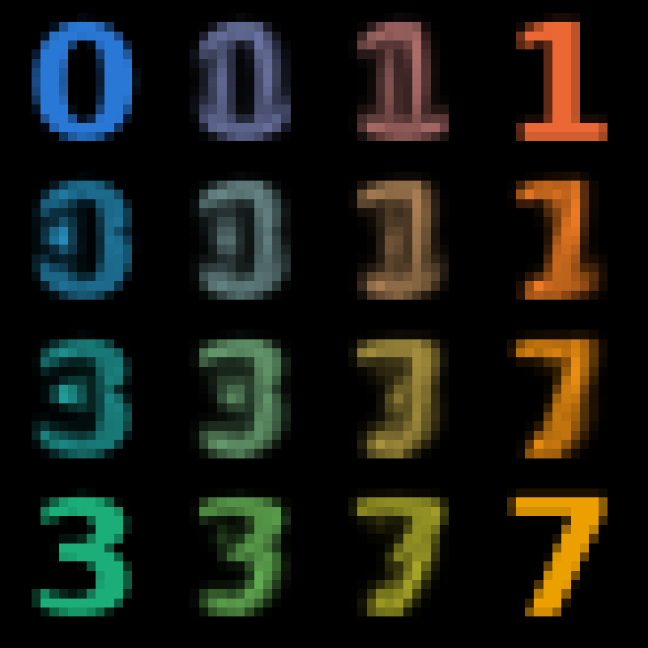

# Gallery

The figures are generated by
[`docs/figures/make_figures.py`](https://github.com/dcgentile/graphtransport-py/blob/main/docs/figures/make_figures.py).

## A geodesic

<figure markdown>
{ width="320" }
{ width="320" }
<figcaption>From a blob in one corner to a ring, on the 16×16 grid graph, by
shooting. The mass spreads as it travels, then settles into the ring (display
smoothed between nodes).</figcaption>
</figure>

## Barycenters of digits

<figure markdown>
{ width="420" }
<figcaption>The corners are four 16×16 digit images, densities on the pixel grid.
Every other panel is their barycenter, for weights bilinear in the panel's
position, by the SOCP. Colour is only a label: each corner digit has a hue, and
each barycenter shows the same weighted mix.</figcaption>
</figure>

## Three methods, one transport

<figure markdown>

<figcaption>The blob-to-ring geodesic at time ½, one square per node: shooting
and the SOCP agree; Sinkhorn's entropic interpolation blurs.</figcaption>
</figure>

## Gradient descent on a density

<figure markdown>

<figcaption>Minimising the transport distance to a target with Adam; see
<a href="../differentiable/">differentiable geodesics</a>.</figcaption>
</figure>
